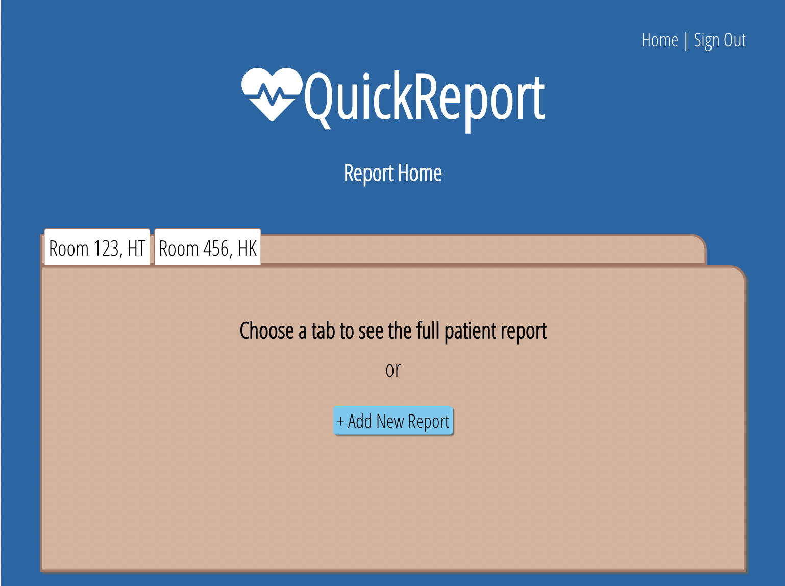
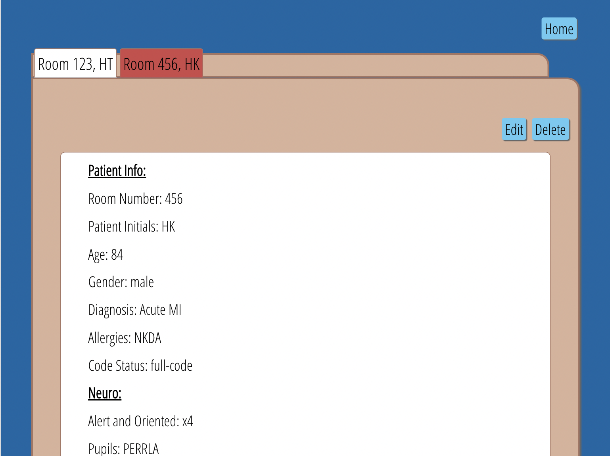
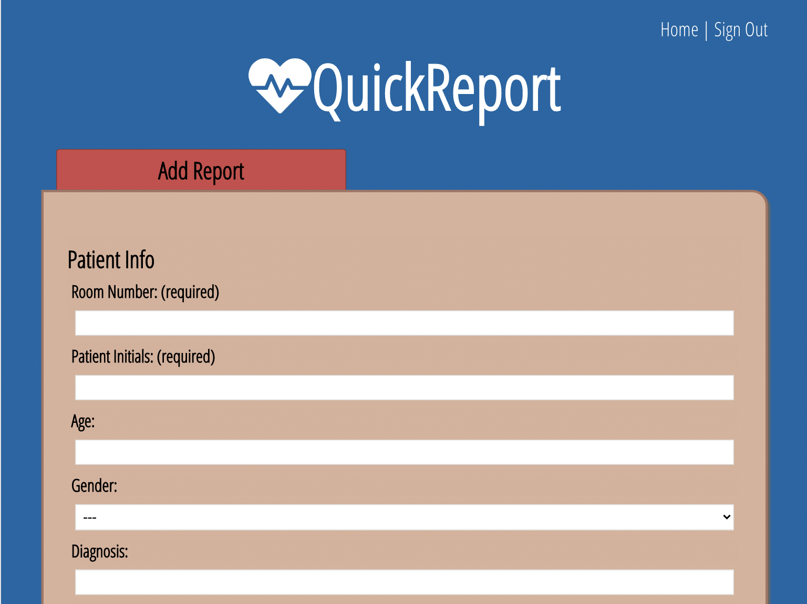
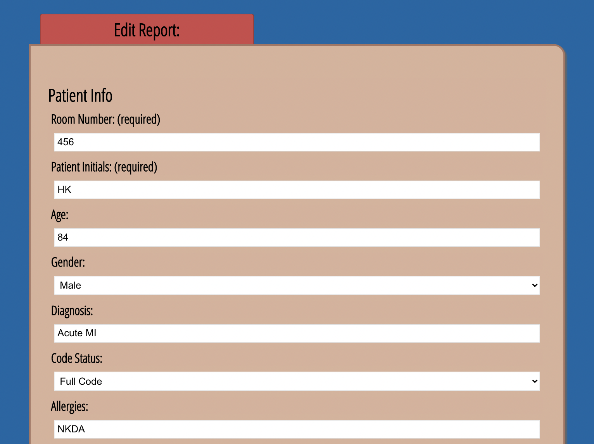
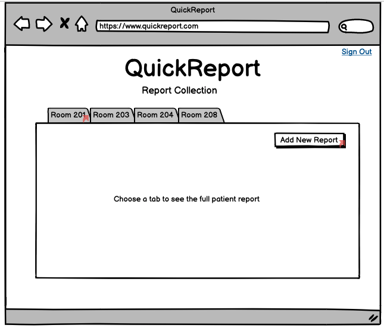
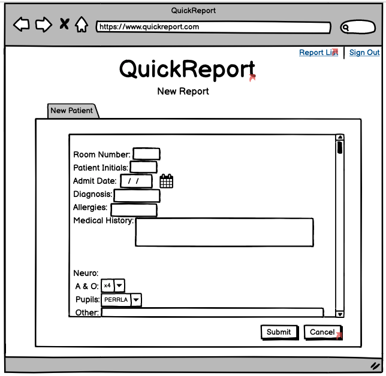
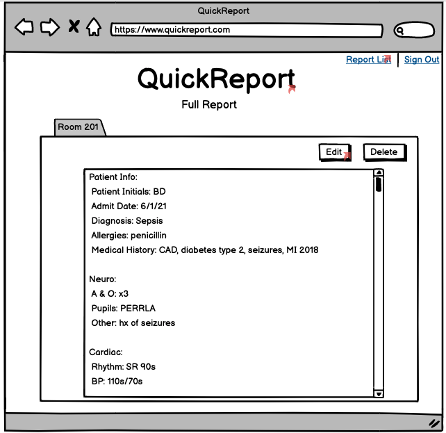

# QuickReport

## Summary

QuickReport is a full-stack PERN app designed to help nurses and other healthcare professionals take report (gather details) on their patients.

The QuickReport client-side allows users to view, create, edit and delete multiple patient reports. The connected API was also written by me and can be viewed [here](https://github.com/SabrinaSides/quick-report-api).

## See the App Live

[Check It Out Here](https://quick-report-client.vercel.app/)

## Tech Stack

**Client:** React, Vanilla CSS

**Server:** Node, Express, PostgreSQL

[View the Server Repo](https://github.com/SabrinaSides/quick-report-api)

## Screenshots

### Landing Page

### Reports Home Page

### Full Report Page

### Add Report Page

### Edit Report Page

## Wireframes

